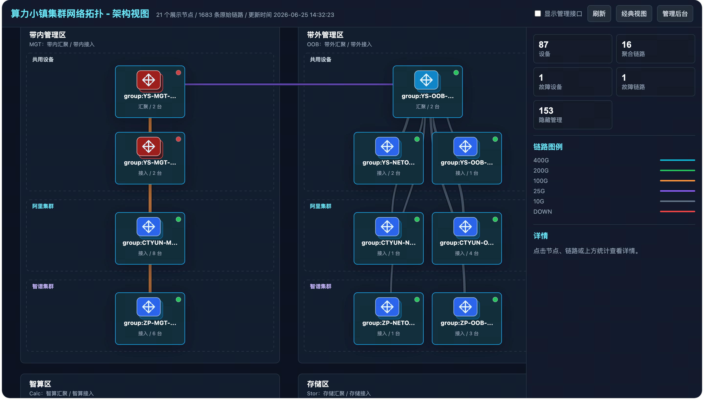

# 集群拓扑监控（web）

- 静态前端配合轻量后端，展示与管理网络/集群拓扑，支持多拓扑多集群。
- 支持管理员登录与在线编辑配置，历史快照与回滚。
- 数据可从 Prometheus 或 VictoriaMetrics 查询接口获取指标，生成设备、端口与链路数据；架构视图默认 6 分钟刷新。

## 目录结构
- `server/` 后端服务（Gin），提供静态资源与配置 API
- `cmd/` 数据采集脚本：
  - `cmd/devices.py` 基于监控中的网络设备 `up` 指标同步 `devices.json` 与 `devices-meta.json`
  - `cmd/lldp.go` 基于 LLDP 指标生成 `links-raw.json` 与 `links.json`
  - `cmd/snmp.py` 基于 SNMP/流量指标生成 `topology.json`
- `config/` 配置文件与示例（受保护写入）
  - `.users.local` 两行明文：第1行用户名，第2行密码
  - `group_rules.json`、`architecture_config.json`、`topology_config.json`/`topology.config.json`、`positions.json`、`link_overrides.json`
  - `.history/` 按文件归档最近版本，支持查看与回滚
- `icons/` 设备与组图标资源
- `examples/` 采集任务的 systemd 定时示例
- 根目录下若干前端页面：`topology.html`、`config.html`、`login.html`、`debug.html`、`ethernet.html`
- 数据文件（前端只读）：`devices.json`、`links.json`、`topology.json`
- 调试/辅助数据：`devices-meta.json`、`links-raw.json`、`links-alias-raw.json`、`links-alias.json`

## 快速开始
- 依赖：
  - Go ≥ 1.20
  - Python ≥ 3.8，且安装 `requests`
- 启动后端：
  - `go run server/main.go`
  - 浏览器访问 `http://localhost:8181/`
- 可用环境变量：
  - `PORT` 默认 `8181`
  - `WEB_ROOT` 静态资源根目录，默认 `..`（项目根）
  - `CONFIG_DIR` 配置目录，默认 `../config`
  - `DATA_ROOT` 动态数据目录，默认等于 `WEB_ROOT`，可用于测试项目复用现有数据文件
  - `JWT_SECRET` JWT 签名密钥，默认开发值，生产必须覆盖

## 登录与权限
- 在 `config/.users.local` 写入两行：
  - 第1行用户名
  - 第2行密码
- `POST /topology/api/login` 获取 `token` 后在请求头加入 `Authorization: Bearer <token>` 即可访问受保护接口。

## 前端页面
- `/topology/` 与 `/topology/topology.html` 默认进入架构拓扑视图，按区域、集群、角色聚合展示链路。
- `/topology/modern.html` 与 `/topology/topology-modern.html` 保留经典拓扑视图，支持图例、故障高亮、管理员模式与前台编辑工具条。
- `config.html` 简化的配置查看/编辑入口（通过后端 API）。
- `login.html` 管理员登录界面。

## 配置文件说明
- `config/group_rules.json` 分组与样式覆盖规则。
- `config/architecture_config.json` 架构视图规则，配置分区、集群、角色、布局行与刷新周期；缺失时退化为单分区、单集群、单角色。
- `config/topology_config.json` 或 `config/topology.config.json` 全局样式、布局与交互参数。
- `config/positions.json` 节点/组坐标与锁定，用于拖拽保存布局。
- `config/link_overrides.json` 连线黑白名单，仅影响显隐。
- 页面在缺失配置时提供默认包的下载入口，放置到 `config/` 即生效。

## 数据源与采集
- `devices.json` 设备名列表，以监控中的网络设备 `up` 指标为准。
- `devices-meta.json` 设备元数据，包含 IP、job、当前 up/down 状态等。
- `links.json` 设备间连线（正式链路，优先由端口别名从当前 `topology.json` 同步生成，LLDP 采集保留为补充/调试来源）。
- `links-raw.json` 原始链路（调试用）。
- `topology.json` 设备端口速率与流量聚合（由 SNMP 指标从 Prometheus/VictoriaMetrics 查询生成）。
- 采集脚本：
  - 运行设备清单同步：
    - `python3 cmd/devices.py`
    - 输出更新 `devices.json` 与 `devices-meta.json`
  - 运行节点/端口采集：
    - `python3 cmd/snmp.py`
    - 输出更新 `topology.json`，并基于端口别名同步更新 `links-raw.json` 与 `links.json`
  - 运行 LLDP 链路采集：
    - `go run cmd/lldp.go`
    - 输出 `links-raw.json`（原始）与过滤后的 `links.json`
  - 如需只从现有 `topology.json` 的端口别名重建链路，可运行：
    - `python3 cmd/snmp.py --links-from-topology`
    - 输出 `links-raw.json` 与 `links.json`
- 可参考 `examples/snmp.service` 与 `examples/snmp.timer` 将采集任务以 systemd 定时运行。

## 后端 API
- `GET /topology/api/health` 服务健康检查
- `POST /topology/api/login` 登录，读取 `config/.users.local` 生成 JWT
- `GET /topology/api/config/:name` 读取配置
  - `name ∈ {group_rules, architecture, topology_config, positions, link_overrides}`
- `PUT /topology/api/config/:name` 写入配置（需 `Bearer`），支持内容未变时的无操作返回
- `GET /topology/api/history/:name` 查看历史版本列表
- `POST /topology/api/history/:name/backup` 从当前配置创建快照
- `POST /topology/api/history/:name/rollback` 按时间戳回滚配置
- 静态与数据：
  - `/topology/web` 映射到 `WEB_ROOT`
  - `/topology/icons` 映射到 `WEB_ROOT/icons`
  - `/topology/` 与 `/topology/topology.html` 进入架构拓扑视图
  - `/topology/modern.html` 与 `/topology/topology-modern.html` 进入经典拓扑视图
  - `/topology/devices.json`、`/topology/links.json`、`/topology/topology.json`、`/topology/prometheus.json` 优先从 `DATA_ROOT` 读取，若不存在则返回空结构

## 部署建议
- 设置环境变量强化安全与路径：
  - `JWT_SECRET` 使用强随机字符串
  - `WEB_ROOT` 指向静态资源所在目录
  - `CONFIG_DIR` 指向配置持久化目录（确保可写）
- 通过反向代理暴露 `8181` 端口，开启 TLS。
- 将采集脚本按需写入定时任务，保证数据文件持续更新。

## 开发问题记录
- 前端使用 `vis-network`，图标资源走 `/icons/*`，缓存头已优化。
- 管理员模式支持在线检查缺失配置与下载默认包；前台编辑可在无后端写入时使用本地缓存并导出 JSON。
- 需要定制风格与图标时可修改 `config/topology_config.json` 的 `default_icons` 与布局相关字段。
